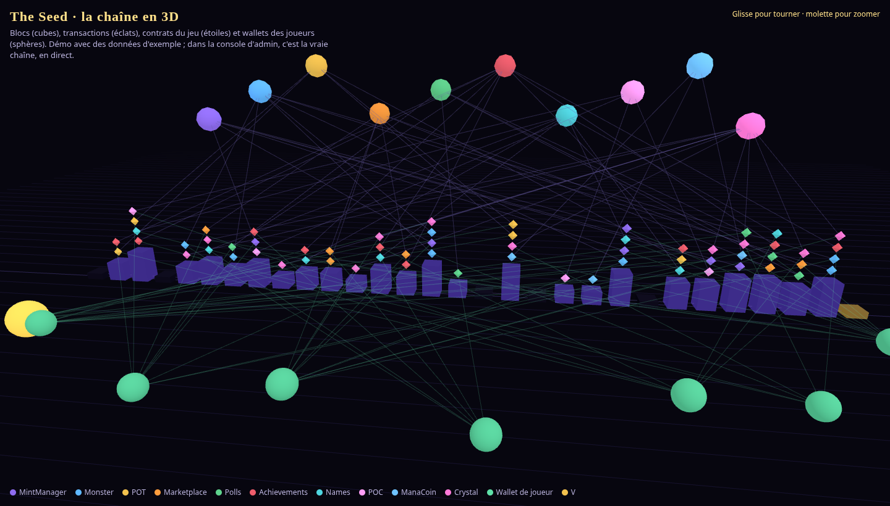
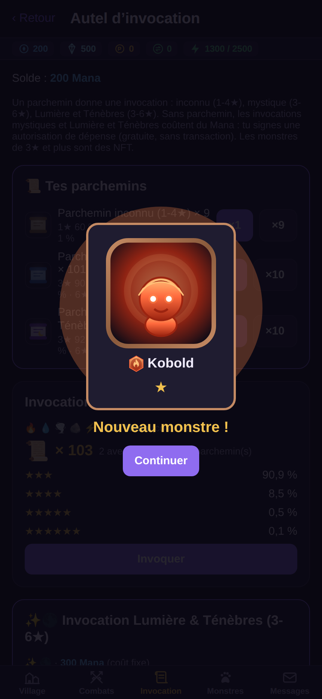
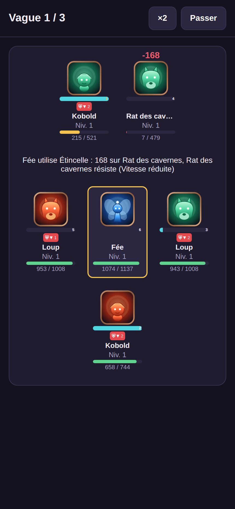
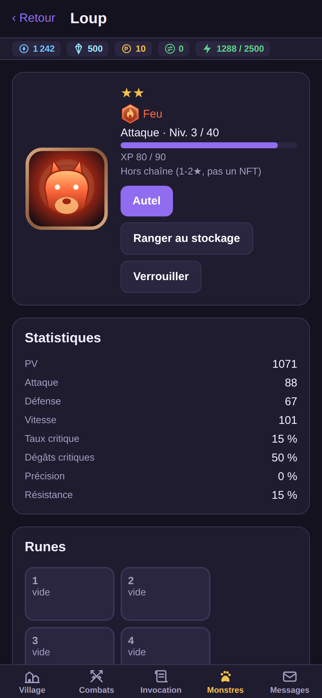
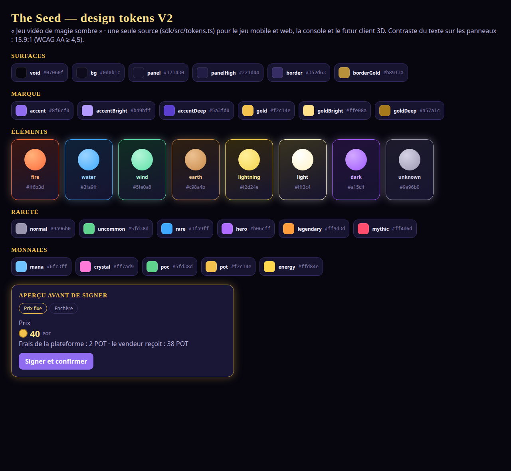

# 🌱 The Seed — vitrine

**Un jeu de monstres à collectionner dans l'esprit de *Summoners War*, en plus grand, sur la
blockchain, avec des agents IA.** Identité par wallet, échanges entre joueurs par contrats,
actions signées sans frais pour le joueur.

Ce dépôt est la **vitrine publique** du projet : l'interface, les graphismes, la vue 3D de la
blockchain et la feuille de route. Le code complet (contrats, serveur, sécurité) reste privé pour
l'instant ; une version stable publique viendra plus tard.

## À voir

| | |
|---|---|
| 🎮 Captures du jeu (invocations, combats, runes, marché…) | [`screenshots/`](screenshots/) |
| ⛓️ La chaîne en 3D (démo autonome, three.js) | [`showcase/chain-3d/index.html`](showcase/chain-3d/index.html) |
| 🎨 Design tokens V2 « magie sombre » | [`showcase/sdk/tokens.ts`](showcase/sdk/tokens.ts), [`showcase/design/tokens-v2.html`](showcase/design/tokens-v2.html) |
| 🧩 Composants d'interface du jeu (React Native) | [`showcase/game-ui/`](showcase/game-ui/) |
| 🔮 Feuille de route en 10 étapes | [`ROADMAP.md`](ROADMAP.md) |

  
  
  

## 🌍 Dans la vraie vie : pourquoi tokeniser des actifs

The Seed prouve en jeu ce que la blockchain apporte aux actifs réels. Ce n'est **pas pour tout de
suite** : il faudra un audit et un cadre légal.

| Dans le jeu | Dans la vraie vie |
|---|---|
| Un monstre NFT appartient à son wallet, personne ne peut le retirer ni le copier | Propriété vérifiable d'un titre, d'un billet, d'un certificat |
| La marketplace garde l'actif et le paiement en séquestre | Échange sans intermédiaire de confiance, frais publics |
| Chaque vente est historisée sur la chaîne | Traçabilité : provenance, authenticité |
| Les règles sont écrites dans le contrat | Royalties, droits, échéances programmables |
| Les sondages on-chain, avec le veto de V | Gouvernance vérifiable d'une communauté |

## La pile

Solidity + Foundry (OpenZeppelin Upgradeable, UUPS) · Python 3.12 + FastAPI + PostgreSQL ·
Expo / React Native · React + Vite + wagmi + three.js · TypeScript strict · agents IA et MCP.

Projet de **V** ([@VZero911](https://github.com/VZero911)), développé avec **SYSTEM** (Claude Code).
