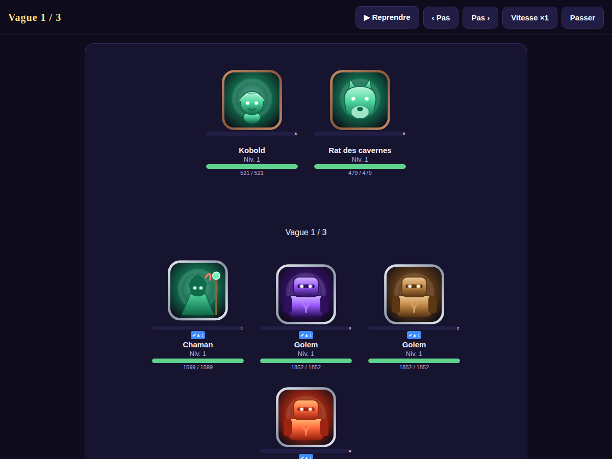
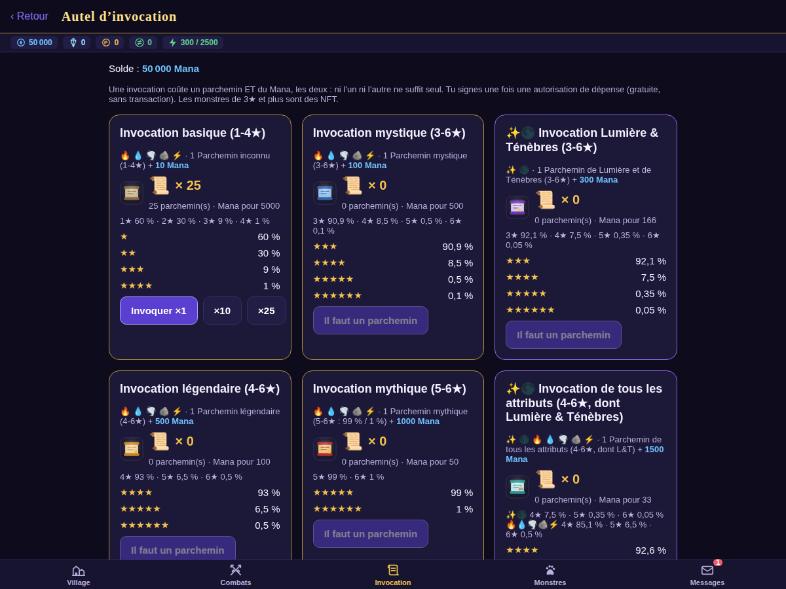
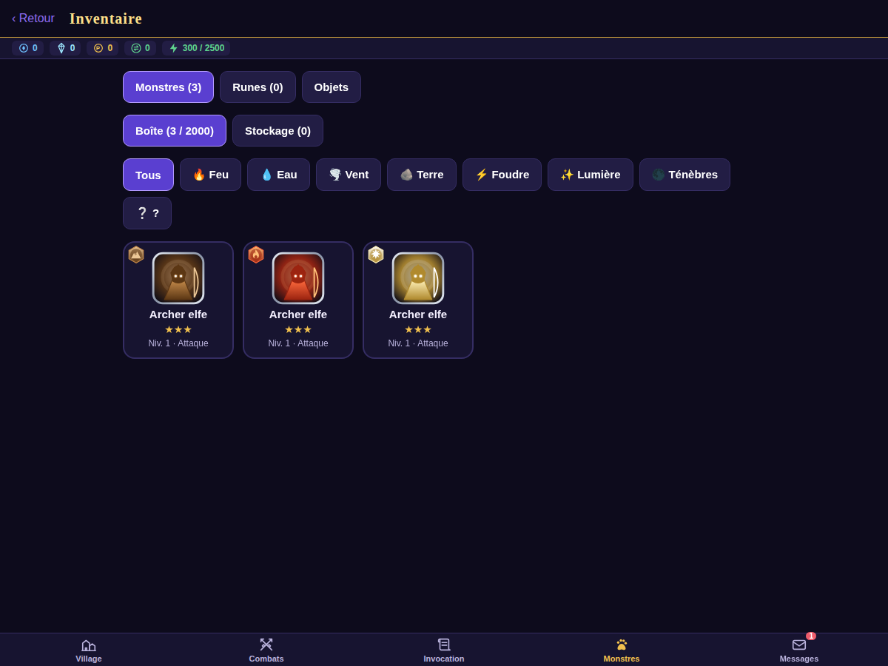
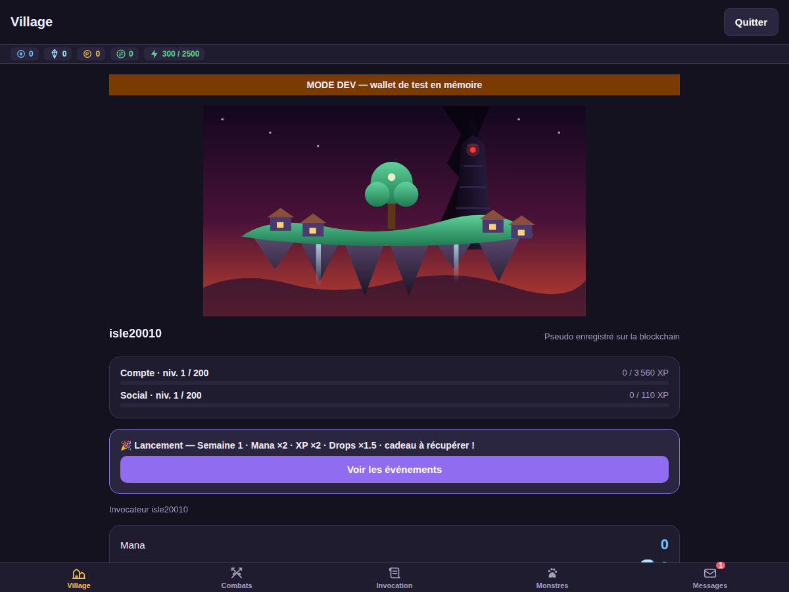

# 🌱 The Seed by VZero911 — showcase

**A monster-collecting game in the spirit of *Summoners War*, bigger, on the blockchain, with AI
agents.** Your identity is a wallet, trades between players go through smart contracts, and every
action is signed for free.

This repository is the **public showcase** of the project: the interface, the graphics, the 3D
view of the blockchain and the roadmap. The full code (contracts, server, security) stays private
for now; a stable public version will come later. It is updated automatically every 2 hours.

## See

| | |
|---|---|
| 🎮 Game screenshots (summons, battles, runes, marketplace…) | [`screenshots/`](screenshots/) |
| ⛓️ The chain in 3D (standalone demo, three.js) | [`showcase/chain-3d/index.html`](showcase/chain-3d/index.html) |
| 🎨 Design tokens V2, "dark magic" | [`showcase/sdk/tokens.ts`](showcase/sdk/tokens.ts), [`showcase/design/tokens-v2.html`](showcase/design/tokens-v2.html) |
| 🧩 Game UI components (React Native) | [`showcase/game-ui/`](showcase/game-ui/) |
| 🔮 The roadmap in 10 steps | [`ROADMAP.md`](ROADMAP.md) |

<b>🎮 Game screens</b>

  
  
  

  
  

<b>🏝️ The Village</b> (V2 art, to be replaced)

## Where it stands

Playable on a local test chain (nothing has real value): summons, battles, runes with automatic
upgrade and grinding, the altar, a world boss, guilds, polls and achievements engraved on chain,
and an on-chain marketplace (sales, auctions, offers). About 1,900 automated tests and 18 browser
walks run before every change.

## 🎨 Looking for artists

3D artists (monsters, the floating-island Village and its tower), 2D artists and illustrators
(monster art, icons, banners) and UI artists. Sound and music: later. Credit and contribution
points (POC) are on the table. Write to vzero911@gmail.com or on Discord (**vzero911**).

## 🏆 The Seed Top Contributor

The ranking of the people who build The Seed, by **POC** (Point of Contribution: earned, never
bought). SYSTEM (the AI agent) and V lead it, rewarded every 2 hours for each commit. Someday,
someone may catch up.

## 🌍 In real life: why tokenize assets

The game proves what a blockchain brings to real assets. **Not for today**: real value needs
audits and a legal frame first.

| In the game | In real life |
|---|---|
| A monster NFT belongs to its wallet: nobody can take or copy it | Verifiable ownership of a title, a ticket, a certificate |
| The marketplace holds the asset and the payment in escrow; 2.5 % of each sale goes to the system's creator (royalties) | Trades without a trusted middleman, public fees and royalties |
| Every sale is recorded on-chain | Traceability: provenance, authenticity |
| The rules are written in the contract | Programmable royalties, rights, deadlines |
| On-chain polls, with V's veto | Verifiable community governance |

## 🖤 Next: The Seed OS

*Same seed, another soil.* An operating system, from an Arch Linux base, where the wallet is the
identity and the AI is part of the system. **Nothing more for now.** 👁️

## Stack

Solidity + Foundry (OpenZeppelin Upgradeable, UUPS) · Python 3.12 + FastAPI + PostgreSQL ·
Expo / React Native · React + Vite + wagmi + three.js · TypeScript strict · AI agents and MCP.

A project by **V** ([@VZero911](https://github.com/VZero911)), built with **SYSTEM** (Claude Code).

---

*© 2026 V (VZero911). Built by V with SYSTEM, an AI agent powered by Claude (Anthropic). See [NOTICE](NOTICE.md).*
